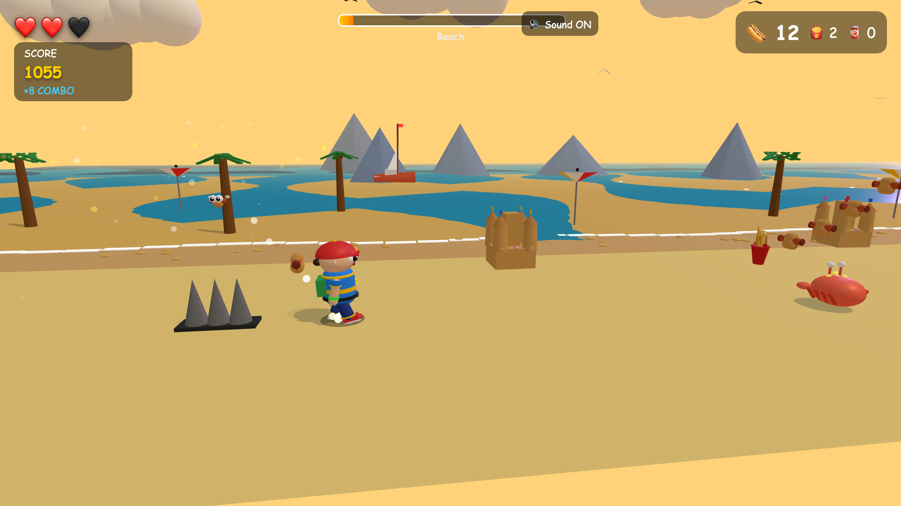

# 🌭 Hot Dog Hero

A colorful 3D side-scrolling runner. Grab hot dogs, dodge trash cans, flip over
bicycles, and race to the giant finish-line arch with a spinning hot dog on top.

### ▶️ [Play it in your browser](https://lucapinello.github.io/hot-dog-hero/)

## The story

I built this over a weekend with my son **Elliot**. He wanted a game where a
tiny hero runs around collecting hot dogs, so we sat down together and made one.
He chose the colors, picked the obstacles ("a trash can! and a fire hydrant!
and a dog chasing you!"), decided the boy character should wear a red cap, and
approved every pigtail bow on the girl. Claude wrote the code and we were the creative
director, playtester, and relentless QA team :)

It's silly and fun with goofy realism, no sober palette — just a dad and a kid trying to make each other laugh.

## How to play

- **← / →** or **A / D** — run
- **Space** or **↑** — jump (tap twice for a flip)
- **Esc** — pause

Pick up power-ups to ride a bicycle, motorcycle, car, or airplane. Build up a
combo by grabbing collectibles and flying past obstacles. Five levels: Street,
Park, Beach, City, Airport.

## Tech

Single `index.html`, Three.js from unpkg, no build step. Drop the file in any
browser and it runs. That was the whole point — Elliot wanted to be able to
double-click it.

## Credits

Made with love by Luca & Elliot & Claude.
